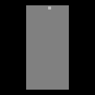

# gym-simpletetris

Simple Tetris is a simple Tetris environment built entirely in Python. Several
options are provided for modifying the environment and its reward system.



## Installation

### pip
The preferred installation of `gym-simpletetris` is via `pip`:

```shell
pip install gym-simpletetris
```

### Clone the project
The code is easy to read and modify. If you wish to modify the package to your
needs, then follow these instructions:

1. Fork the project
2. Download it using:
```shell
git clone https://github.com/<YOUR-USERNAME>/gym-simpletetris
```
3. Make your changes
4. Install it using pip:
```shell
cd gym-simpletetris
pip install -e ./
```

## Usage

You can create an environment using `gym.make` and supplying the environment id.
```python
import gym
import gym_simpletetris

env = gym.make('SimpleTetris-v0')
obs = env.reset()

episode = 0
while episode < 10:
    action = env.action_space.sample()
    obs, reward, done, info = env.step(action)
    
    if done:
        print(f"Episode {episode + 1} has finished.")
        episode += 1
        obs = env.reset()

env.close()
```

## Environment

Several options are provided to modify the environment. Arguments can be used
at the creation of the environment:

```python
import gym
import gym_simpletetris

env = gym.make('SimpleTetris-v0',
               height=20,                       # Height of Tetris grid
               width=10,                        # Width of Tetris grid
               obs_type='ram',                  # ram | grayscale | rgb
               extend_dims=False,               # Extend ram or grayscale dimensions
               render_mode='rgb_array',         # Only supports rgb_array
               reward_step=False,               # See reward table
               penalise_height=False,           # See reward table
               penalise_height_increase=False,  # See reward table
               advanced_clears=False,           # See reward table
               high_scoring=False,              # See reward table
               penalise_holes=False,            # See reward table
               lock_delay=0                     # Lock delay as number of steps
               )
```

If using an observation type of grayscale or rgb then the environment will be
as an array of size 84 x 84. If using grayscale, then the grid can be returned
as 84 x 84 or extended to 84 x 84 x 1 if `entend_dims` is set to True. The rgb
array will always be returned as 84 x 84 x 3. If using an observation type of
ram and `extend_dims` is set then an array of size width x height x 1 is
returned.

**Note: The environment only supports rendering as `rgb_array` at this time but a human
render option is planned in a future update.**

### Reward Table

| Option                     | Description                                                                                                                                                                                                                               |
|:---------------------------|:------------------------------------------------------------------------------------------------------------------------------------------------------------------------------------------------------------------------------------------|
| `reward_step`              | Adds a reward of +1 for every time step that does not include a line clear or end of game.                                                                                                                                                |
| `penalise_height`          | Penalises the height of the current Tetris tower at every time step. A negative reward equal to the height of the current tower is added at every time step.                                                                              |
| `penalise_height_increase` | Penalises an increase in the height of the Tetris tower. At each time step, if the height increases then a negative reward equal to the increase is given.                                                                                |
| `advanced_clears`          | Changes the rewards for clearing lines to be similar to the modern Tetris system. The new rewards are 100 for a single line clear, 250 for a double line clear, 750 for a triple line clear and 3000 for a Tetris (quadruple line clear). |
| `high_scoring`             | Changes the reward given for each line clear to 1000.                                                                                                                                                                                     |
| `penalise_holes`           | Penalises the number of holes in the current Tetris tower. A hole is an empty cell with at least one non-empty cell above it.                                                                                                             |

**Note: `penalise_height` and `penalise_height_increase` cannot be used together.
If both are enabled then penalise_height will be used.**

### `info` dictionary

The info dictionary returned by each step includes the following keys:

| Key             | Type     | Description                                                        |
|:----------------|:---------|:-------------------------------------------------------------------|
| `time`          | `int`    | The time passed (no. of steps) since the start of the current game |
| `current_piece` | `string` | The letter representing the current piece                          |
| `score`         | `int`    | The score of the current game                                      |
| `lines_cleared` | `int`    | The number of lines cleared in the current game                    |
| `holes`         | `int`    | The number of holes in the current Tetris tower                    |
| `deaths`        | `int`    | The number of deaths since the environment was created             |
| `statistics`    | `dict`   | The number of Tetris pieces dispatched by type                     |


